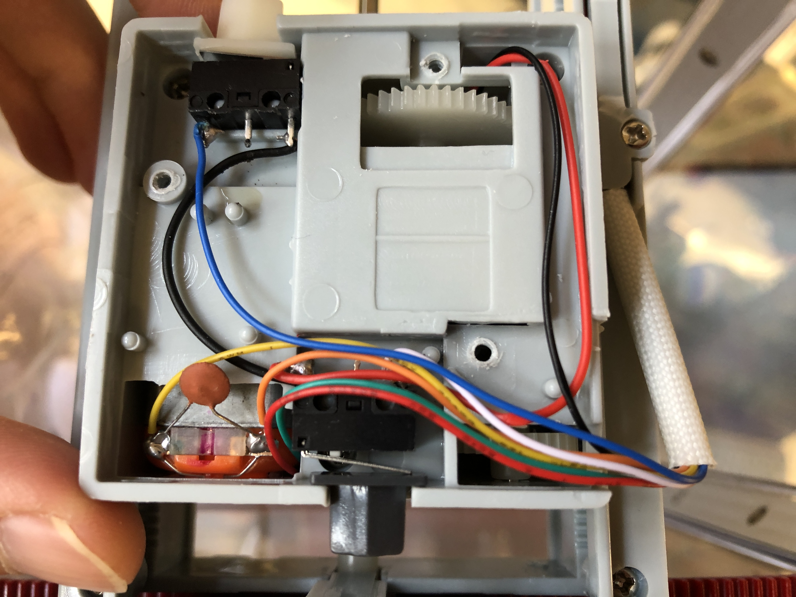
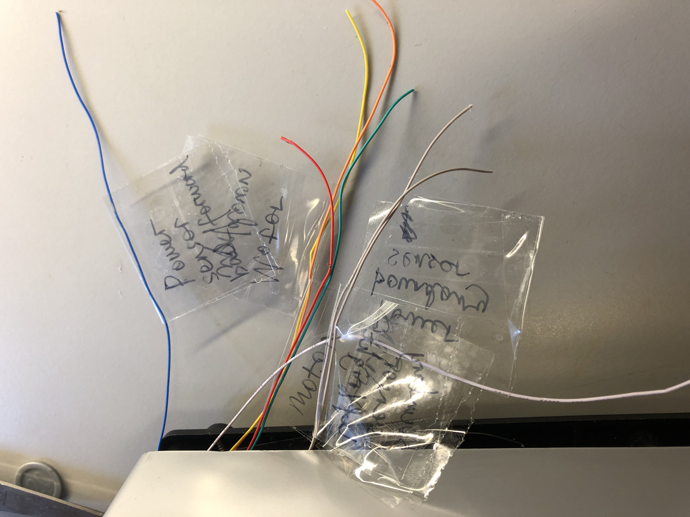
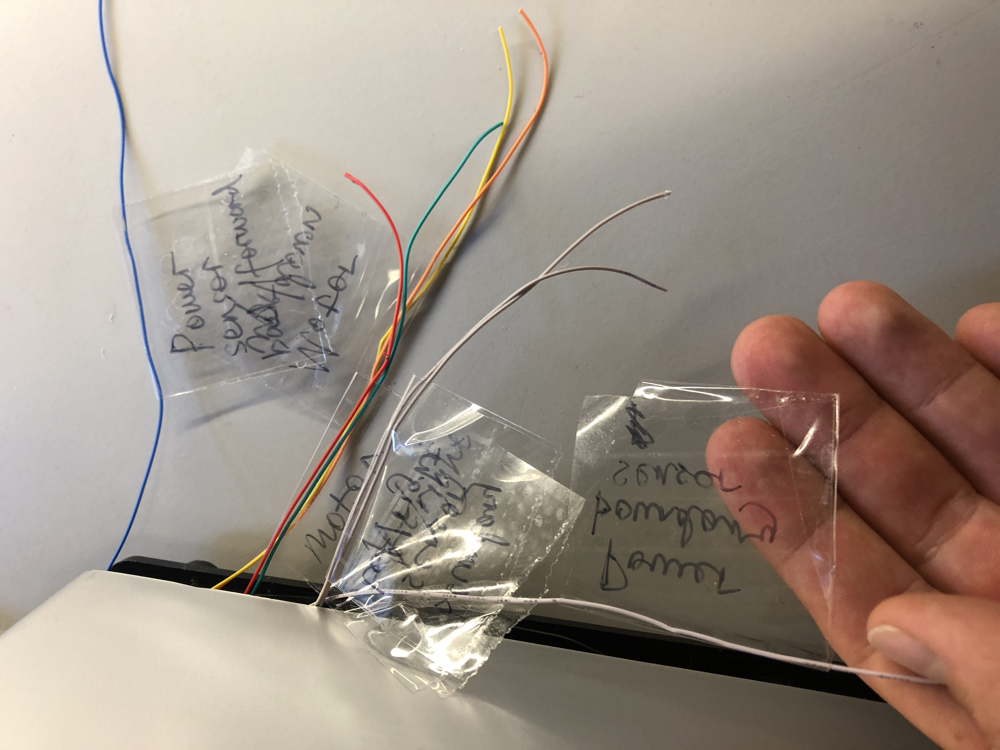
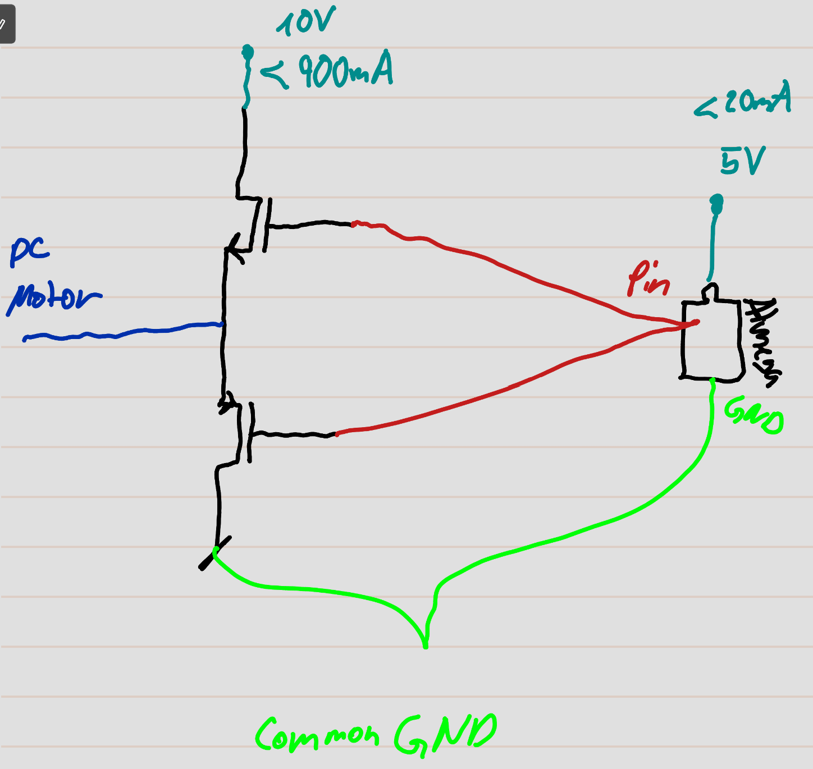

# final-project-skeleton

    * Team Name: Clawsome Claverine
    * Team Members: August Fu & Darian Mettler
    * Github Repository URL: https://github.com/ese3500/final-project-clawsome-claverine
    * Github Pages Website URL: (not present yet)
    * Description of hardware: ATmega328PB, Windows on Arm 11 (Surface X Pro)

## Final Teardown report

### Work done
- We labeled all the calbes
- We found out how the cables are supposed to work
- All the wires to the top part was cut

### Motor control
- 3 motors
- Each motor has two wires (ground and hight)
- Those are DC motors, 4.2V (backward -4.2V, forward 4.2V)

### Sensors
- Boundary detection sensors
    - The right/left motors have two sensors to signal the boundary hit
    - The back/forth motors have two sensors to signal the boundary hit
    - They work like common buttons wit a pull up resistor attached
- Sucsess Sensor
    - LED always lighting towards the sensor with light in a specific frequency
    - Light sensor which detets if the incomming light from the matching frequency is too low and then it goes down.

### Actuators
- Buzzer
- Coin detection mechanism

## Project Build documentation
### Setup
#### Parts used
- ATmega328PB
- Adafruit, 1.8'' TFT, LCD Display
- Parts from basic clawing machine
    - Crane
    - Collision sensors

#### Motor control circuit
The circuit we have done so far is the motor control circuit, which is able to sink and supply enough voltage and current to drive to motors controlled by the ATmega. However, it only consists out of eight pull up/down paths as shown in the picture below. Each of those paths is able to take the output of one pin of the atmega and convert it in either a 4.5V output which can supply up to 200mA or a 0V output which is able to sink up to 200mA. It is quite a simple technique, and we are using high power P-Channel and N-Channel MOSFETs.

#### Connections to ATmega328PB

| ATmega328PB port | Connected device | Connected device port | remark |
|----------|----------|----------|----------|
|PB0|Adafruit, 1.8'' TFT, LCD Display|D/C|          |
|PB1|Adafruit, 1.8'' TFT, LCD Display|RESET|          |
|PB2|Adafruit, 1.8'' TFT, LCD Display|TFT_CS|          |
|PB3|Adafruit, 1.8'' TFT, LCD Display|MOSI|          |
|PB5|Adafruit, 1.8'' TFT, LCD Display|SCK|          |
|PD6|Adafruit, 1.8'' TFT, LCD Display|LITE|          |
|          |          |          |          |
|          |          |          |          |
|          |          |          |          |

##### Connections to Ground (Yellow)
| Connected device | Connected device port | remark |
|----------|----------|----------|
|Adafruit, 1.8'' TFT, LCD Display|GND|          |
|          |          |          |
|          |          |          |
|          |          |          |
|          |          |          |

##### Connections to Vcc (5V) (Green)
| Connected device | Connected device port | remark |
|----------|----------|----------|
|Adafruit, 1.8'' TFT, LCD Display|VCC|          |
|          |          |          |
|          |          |          |
|          |          |          |
|          |          |          |

### Libraries and connectins used
- UART for Debugging

### Sources
- We used parts of the code provided in class, the labs as well as the worksheets
- Parts of the code are from Augusts and Darians solutions to the labs and worksheets

## Github Repo Submission Resources

You can remove this section if you don't need these references.

* [ESE5160 Example Repo Submission](https://github.com/ese5160/example-repository-submission)
* [Markdown Guide: Basic Syntax](https://www.markdownguide.org/basic-syntax/)
* [Adobe free video to gif converter](https://www.adobe.com/express/feature/video/convert/video-to-gif)
* [Curated list of example READMEs](https://github.com/matiassingers/awesome-readme)
* [VS Code](https://code.visualstudio.com/) is heavily recommended to develop code and handle Git commits
  * Code formatting and extension recommendation files come with this repository.
  * Ctrl+Shift+V will render the README.md (maybe not the images though)
