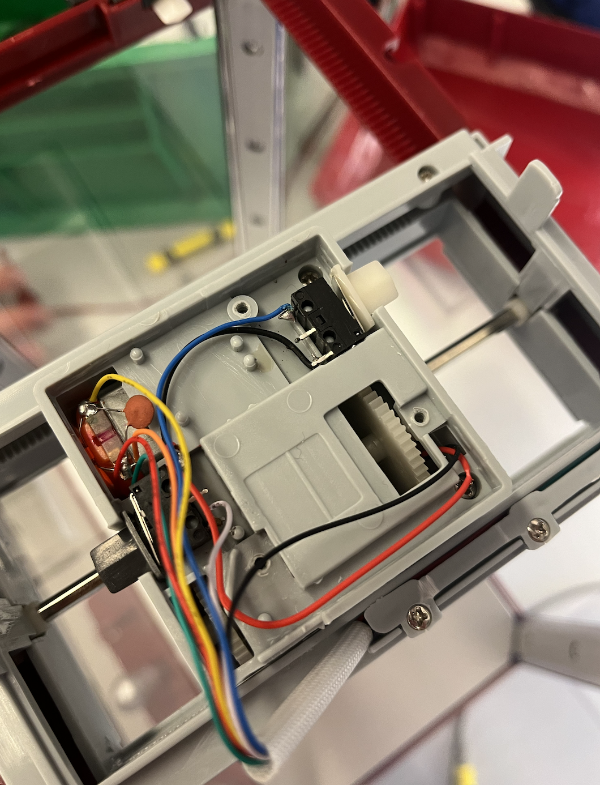

# final-project-skeleton

    * Team Name: Clawsome Claverine
    * Team Members: August Fu & Darian Mettler
    * Github Repository URL: https://github.com/ese3500/final-project-clawsome-claverine
    * Github Pages Website URL: (not present yet)
    * Description of hardware: ATmega328PB, Windows on Arm 11 (Surface X Pro)

## Final Project Proposal

### 1. Abstract

<!--In a few sentences, describe your final project. This abstract will be used as the description in the evaluation survey forms.-->

We will assemble and programm our own clawing machine with the help of the ATmega328PB with some extra features like a screen for a countdown or party LED's. A claw machine is an arcade game where players use a mechanical claw to try and grab prizes inside a glass enclosure. Players control the claw with one or more joysticks, attempting to grab a prize by maneuvering the claw over it and pressing a button (or using a joystick) to lower it. Winning prizes can be challenging due to the game's rigged nature, adding to its excitement, even extra gittering motion can be added to make it harder (which could be done for example with game modes).

### 2. Motivation

<!--What is the problem that you are trying to solve? Why is this project interesting? What is the intended purpose?-->

What if I told you that entertainment, excitement, and endless fun were just a claw's reach away? Our Claw Machine brings the excitement of the arcade into Dedkin, offering an irresistible experience that captivates players of all majors and levels. But wait, there's more! Our Claw Machine isn't just about winning prizes, it's about creating unforgettable memories and moments of pure joy to balance your work when you are rushing throught the assignment 5 hours before due. And the best, our machine is not the usual one you know but it is upgraded with an additional screen for more tention and LED's for the maximum excitement.

The motivation behind our Claw Machine project stems from the desire to provide a captivating and enjoyable experience to individuals in need of a break from their daily routines. As students ourselves, we understand the pressures and stresses that often accompany academic responsibilities. Our goal is to create a fun and immersive activity that not only entertains but also fosters moments of joy and relaxation.

The classic claw machine arcade game has a timeless appeal, offering a blend of anticipation and excitement as players attempt to grab prizes. By bringing this experience to our university environment, we aim to inject a sense of nostalgia and camaraderie among students. Additionally, our upgraded version of the claw machine with features like an LCD screen for countdowns and party LEDs adds a modern twist, making it even more enticing.

Our motivation extends beyond mere entertainment; we want to create a space where students can unwind, share laughter, and create lasting memories. In the midst of deadlines and assignments, our Claw Machine stands as a beacon of fun and lightheartedness, providing a much-needed respite for everyone.

### 3. Goals

<!--These are to help guide and direct your progress.-->
- Disassemble the purchased claw machine and identify reusable components.
- Implement basic functionality of the claw machine, including start/stop mechanisms, joystick control for claw movement, and grabbing functionality.
- Integrate a countdown screen to display game time and enhance player anticipation.
- Add audio effects using a buzzer for an immersive gaming experience.
- Incorporate party LEDs to create a dynamic and exciting atmosphere during gameplay.
- Implement a light sensor for detecting successful catches, triggering visual and audio effects.
- Introduce different difficulty levels to cater to players of varying skill levels.

### 4. Software Requirements Specification (SRS)

The software requirements for our Claw Machine project are crucial for ensuring smooth functionality and user interaction. We will primarily utilize C programming language for the ATmega328PB microcontroller. Here's a detailed breakdown of our software specifications:

- Interrupts: We will implement interrupts for button presses and state changes, allowing for responsive gameplay and event handling. These interrupts will also manage boundary conditions, ensuring the claw operates within predefined limits.

- State Variables: Utilizing state variables will enable us to control different states of the machine, such as idle, grabbing, and success/failure states. This structured approach enhances code organization and readability.

- Serial Communication: We'll use serial communication to interface with an LCD screen for displaying game information, countdowns, and messages. This communication protocol ensures real-time updates and clear communication with the user.

- ADC for Joystick and Motor Control: Analog-to-Digital Conversion (ADC) will be employed for precise control of the joystick inputs and motor movements. This allows for smooth and accurate maneuvering of the claw, enhancing the gameplay experience.

Our software design focuses on efficiency, reliability, and seamless integration of various components to deliver a cohesive and engaging Claw Machine application.

### 5. Hardware Requirements Specification (HRS)
The hardware requirements form the backbone of our Claw Machine project, dictating the physical components needed for its construction and operation. While we have access to several components from the purchased claw machine, additional hardware elements are necessary for enhancing functionality and user experience:

- ATmega328PB Microcontroller: This serves as the brain of our Claw Machine, handling input/output operations, motor control, and interfacing with other hardware components.

- LCD Screen: We require an LCD screen for displaying game information, countdowns, scores, and instructions. The screen adds a visual dimension to the gameplay, enhancing user engagement.

- LEDs for Party Mode: To create an immersive and celebratory atmosphere, we'll incorporate LEDs that activate during 'party mode,' adding excitement and visual appeal to the gaming experience.

- Additional Motors: Depending on the claw machine's design, we may need extra motors for specific functionalities such as crane movement, claw gripping, and prize dispensing.

- Sensors: These include boundary sensors to prevent overextension of the crane, a light sensor (photoresistor) for detecting successful catches, and any other sensors required for game logic and feedback.

### 6. MVP Demo

<!--What do you expect to accomplish by the first milestone?-->
For the MVP demonstration, our primary objective is to showcase the core functionality of the Claw Machine. By the end of this phase, we aim to achieve the following milestones:

- Basic Claw Movement: Implement joystick control to move the claw horizontally and vertically within defined boundaries.

- Claw Gripping: Enable the claw to open and close, simulating the grabbing action required to pick up prizes.

- LCD Display: Display a simple countdown timer on the LCD screen, indicating the duration of each gameplay session.

- Manual Control: Allow users to start and stop the game manually, providing a basic but functional gaming experience.

While the MVP demo may lack advanced features such as party mode LEDs or complex difficulty levels, it establishes a solid foundation upon which we can build and iterate for the final demonstration.

### 7. Final Demo

<!--What do you expect to achieve by the final demonstration or after milestone 1?-->

The final demonstration of our Claw Machine project aims to showcase a fully functional and immersive gaming experience. By this stage, we expect to have implemented all planned features and enhancements. Key elements of the final demo include:

- Enhanced Claw Control: Fine-tune the claw's movement for precision and responsiveness, ensuring smooth gameplay and increased challenge.

- LCD Interactivity: Expand the LCD screen functionality to include dynamic displays such as game scores, instructions, and interactive menus for selecting game modes.

- Audio Integration: Introduce audio feedback, including music and sound effects triggered by game events such as successful catches or time limits.

- LED Party Mode: Activate the LED lighting system during special game modes or when specific achievements are unlocked, enhancing the visual spectacle of the Claw Machine.

- Success Detection: Implement robust logic using the light sensor to accurately detect successful catches, triggering celebratory animations or sounds.

- Multiple Difficulty Levels: Incorporate varying difficulty levels that affect claw grip strength, movement speed, and prize distribution, providing replay value and challenge progression.

The final demo aims to deliver a comprehensive and captivating Claw Machine experience that not only entertains but also showcases our technical proficiency, creativity, and attention to detail.

### 8. Methodology

<!--What is your approach to the problem?-->

Our methodology involves a strategic approach to building the Claw Machine, focusing on resource optimization and leveraging existing hardware. The decision to purchase a claw machine and dismantle it for parts aligns with the course's emphasis on embedded systems rather than mechanical engineering. This approach allows us to access high-quality components such as motors, sensors, and structural elements without the complexity of designing them from scratch.

The initial phase of the project involves a detailed hardware teardown, where we identify and catalog all salvageable components. This step is crucial for understanding the system architecture and planning the integration of these components into our custom claw machine design. We will document each component's specifications, connections, and functionalities to facilitate smooth integration during the software development phase.

For software development, we will use C programming language to code the ATmega328PB microcontroller, ensuring efficient utilization of its capabilities. We will implement interrupt-driven programming for button presses and state changes, creating responsive user interactions. State variables will control different machine states such as idle, grabbing, and winning, providing a structured approach to managing system behavior.

Serial communication will be utilized for interfacing with the LCD screen, displaying essential information such as game time, instructions, and feedback messages. Additionally, analog-to-digital conversion (ADC) will enable precise control of joystick movements and motor operations, enhancing gameplay responsiveness.

Throughout the project, we will conduct rigorous testing and debugging to ensure functionality, reliability, and safety. We will iteratively refine our design, incorporating feedback from testing phases to enhance user experience and address any technical challenges. Collaboration and effective communication between team members will be paramount to the project's success, with regular progress updates and task allocation to optimize workflow and productivity.

Some pictures of us trying things out and exploring what we can do with the machine!

### 9. Components

<!--What major components do you need and why?-->

- ATmega328PB microcontroller for central processing and control.
- LCD screen for displaying game information and countdown.
- Three AC motors to control the claw movement.
- Claw machine frame structure for housing the components and creating the arcade-style enclosure.
- Buzzer for generating audio effects and enhancing the gaming experience.
- Four boundary sensors on the top of the frame to detect collision boundaries.
- One light sensor (photoresistor) to detect successful catches and trigger visual/audio feedback.

### 10. Evaluation

What is your metric for evaluating how well your product/solution solves the problem? Think critically on this section. Having a boolean metric such as “it works” is not very useful. This is akin to making a speaker and if it emits sound, albeit however terrible and ear wrenching, declare this a success.
It is recommended that your project be something that you can take pride in. Oftentimes in interviews, you will be asked to talk about projects you have worked on.

We want to fully 'hack' the claw machine we purchased and build a augmented version (since we are clawsome claverine!!) that has extra features such as party mode and the LCD screen to indicate game time and other information.

We will evaluate the success of our project based on several criteria:

- Functionality: Ensuring all features work as intended, including claw movement, countdown display, audio effects, and successful catch detection.

- User Experience: Gathering feedback from players to assess the overall gaming experience, including excitement, engagement, and usability.

- Reliability: Testing the reliability and durability of the Claw Machine over extended usage periods.
    Innovation: Assessing the uniqueness and creativity of our augmented Claw Machine compared to traditional arcade machines.

### 11. Timeline

This section is to help guide your progress over the next few weeks. Feel free to adjust and edit the table below to something that would be useful to you. Really think about what you want to accomplish by the first milestone.

| **Week**            | **Task** | **Assigned To**    |
|----------           |--------- |------------------- |
| Week 1: 3/24 - 3/31 | Disassemble claw machine, identify reusable components        | August & Darian                   |
| Week 2: 4/1 - 4/7   | Implement basic claw functionality on ATmega328PB         |  August & Darian                  |
| Week 3: 4/8 - 4/14  | Integrate countdown screen and audio effects         |   August & Darian                 |
| Week 4: 4/15 - 4/21 |	Add party LEDs, implement light sensor for successful catch          |  August & Darian                  |
| Week 5: 4/22 - 4/26 | Final testing, debugging, and preparation for demo presentation         | August & Darian                   |

### 12. Proposal Presentation

Add your slides to the Final Project Proposal slide deck in the Google Drive.

## Final Project Report

Don't forget to make the GitHub pages public website!
If you’ve never made a Github pages website before, you can follow this webpage (though, substitute your final project repository for the Github username one in the quickstart guide):  <https://docs.github.com/en/pages/quickstart>

### 1. Video

[Insert final project video here]

### 2. Images

[Insert final project images here]

### 3. Results

What were your results? Namely, what was the final solution/design to your problem?

#### 3.1 Software Requirements Specification (SRS) Results

Based on your quantified system performance, comment on how you achieved or fell short of your expected software requirements. You should be quantifying this, using measurement tools to collect data.

#### 3.2 Hardware Requirements Specification (HRS) Results

Based on your quantified system performance, comment on how you achieved or fell short of your expected hardware requirements. You should be quantifying this, using measurement tools to collect data.

### 4. Conclusion

Reflect on your project. Some questions to consider: What did you learn from it? What went well? What accomplishments are you proud of? What did you learn/gain from this experience? Did you have to change your approach? What could have been done differently? Did you encounter obstacles that you didn’t anticipate? What could be a next step for this project?

## References

Fill in your references here as you work on your proposal and final submission. Describe any libraries used here.

## Github Repo Submission Resources

You can remove this section if you don't need these references.

* [ESE5160 Example Repo Submission](https://github.com/ese5160/example-repository-submission)
* [Markdown Guide: Basic Syntax](https://www.markdownguide.org/basic-syntax/)
* [Adobe free video to gif converter](https://www.adobe.com/express/feature/video/convert/video-to-gif)
* [Curated list of example READMEs](https://github.com/matiassingers/awesome-readme)
* [VS Code](https://code.visualstudio.com/) is heavily recommended to develop code and handle Git commits
  * Code formatting and extension recommendation files come with this repository.
  * Ctrl+Shift+V will render the README.md (maybe not the images though)
