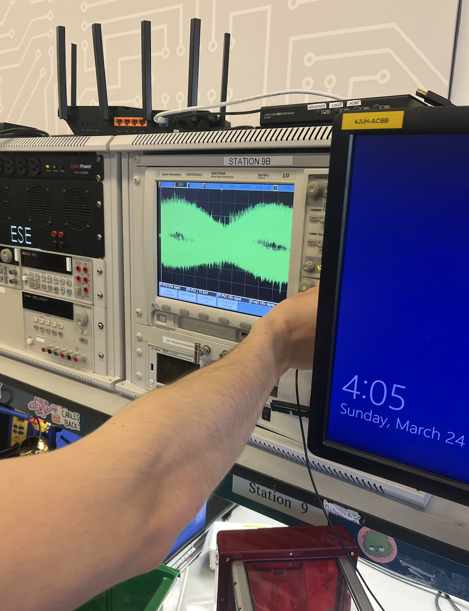

  
   
  

<!-- # Clawsome Claverine -->
<h1 align="center">Clawsome Claverine</h1>

  
   
  

<!-- <h1 align="center">final-project-skeleton</h3> -->
<!-- ### final-project-skeleton -->
<h3 align="center">final-project-skeleton</h3>
    * Team Name: Clawsome Claverine
    * Team Members: August Fu & Darian Mettler
    * Github Repository URL: https://github.com/ese3500/final-project-clawsome-claverine
    * Github Pages Website URL: https://ese3500.github.io/final-project-clawsome-claverine/
    * Description of hardware: ATmega328PB, Windows on Arm 11 (Surface X Pro)

<h2 align="center">Proposal</h2>

### 1. Abstract

<!--In a few sentences, describe your final project. This abstract will be used as the description in the evaluation survey forms.-->

We will assemble and programm our own clawing machine with the help of the ATmega328PB with some extra features like a screen for a countdown or party LED's. A claw machine is an arcade game where players use a mechanical claw to try and grab prizes inside a glass enclosure. Players control the claw with one or more joysticks, attempting to grab a prize by maneuvering the claw over it and pressing a button (or using a joystick) to lower it. Winning prizes can be challenging due to the game's rigged nature, adding to its excitement, even extra gittering motion can be added to make it harder (which could be done for example with game modes).

### 2. Motivation

<!--What is the problem that you are trying to solve? Why is this project interesting? What is the intended purpose?-->

What if I told you that entertainment, excitement, and endless fun were just a claw's reach away? Our Claw Machine brings the excitement of the arcade into Dedkin, offering an irresistible experience that captivates players of all majors and levels. But wait, there's more! Our Claw Machine isn't just about winning prizes, it's about creating unforgettable memories and moments of pure joy to balance your work when you are rushing throught the assignment 5 hours before due. And the best, our machine is not the usual one you know but it is upgraded with an additional screen for more tention and LED's for the maximum excitement.

The motivation behind our Claw Machine project stems from the desire to provide a captivating and enjoyable experience to individuals in need of a break from their daily routines. As students ourselves, we understand the pressures and stresses that often accompany academic responsibilities. Our goal is to create a fun and immersive activity that not only entertains but also fosters moments of joy and relaxation.

The classic claw machine arcade game has a timeless appeal, offering a blend of anticipation and excitement as players attempt to grab prizes. By bringing this experience to our university environment, we aim to inject a sense of nostalgia and camaraderie among students. Additionally, our upgraded version of the claw machine with features like an LCD screen for countdowns and party LEDs adds a modern twist, making it even more enticing.

Our motivation extends beyond mere entertainment; we want to create a space where students can unwind, share laughter, and create lasting memories. In the midst of deadlines and assignments, our Claw Machine stands as a beacon of fun and lightheartedness, providing a much-needed respite for everyone.

### 3. Goals

<!--These are to help guide and direct your progress.-->
- Disassemble the purchased claw machine and identify reusable components.
- Implement basic functionality of the claw machine, including start/stop mechanisms, joystick control for claw movement, and grabbing functionality.
- Integrate a countdown screen to display game time and enhance player anticipation.
- Add audio effects using a buzzer for an immersive gaming experience.
- Incorporate party LEDs to create a dynamic and exciting atmosphere during gameplay.
- Implement a light sensor for detecting successful catches, triggering visual and audio effects.
- Introduce different difficulty levels to cater to players of varying skill levels.

### 4. Software Requirements Specification (SRS)

The software requirements for our Claw Machine project are crucial for ensuring smooth functionality and user interaction. We will primarily utilize C programming language for the ATmega328PB microcontroller. Here's a detailed breakdown of our software specifications:

- Interrupts: We will implement interrupts for button presses and state changes, allowing for responsive gameplay and event handling. These interrupts will also manage boundary conditions, ensuring the claw operates within predefined limits.

- State Variables: Utilizing state variables will enable us to control different states of the machine, such as idle, grabbing, and success/failure states. This structured approach enhances code organization and readability.

- Serial Communication: We'll use serial communication to interface with an LCD screen for displaying game information, countdowns, and messages. This communication protocol ensures real-time updates and clear communication with the user.

- ADC for Joystick and Motor Control: Analog-to-Digital Conversion (ADC) will be employed for precise control of the joystick inputs and motor movements. This allows for smooth and accurate maneuvering of the claw, enhancing the gameplay experience.

Our software design focuses on efficiency, reliability, and seamless integration of various components to deliver a cohesive and engaging Claw Machine application.

### 5. Hardware Requirements Specification (HRS)
The hardware requirements form the backbone of our Claw Machine project, dictating the physical components needed for its construction and operation. While we have access to several components from the purchased claw machine, additional hardware elements are necessary for enhancing functionality and user experience:

- ATmega328PB Microcontroller: This serves as the brain of our Claw Machine, handling input/output operations, motor control, and interfacing with other hardware components.

- LCD Screen: We require an LCD screen for displaying game information, countdowns, scores, and instructions. The screen adds a visual dimension to the gameplay, enhancing user engagement.

- LEDs for Party Mode: To create an immersive and celebratory atmosphere, we'll incorporate LEDs that activate during 'party mode,' adding excitement and visual appeal to the gaming experience.

- Additional Motors: Depending on the claw machine's design, we may need extra motors for specific functionalities such as crane movement, claw gripping, and prize dispensing.

- Sensors: These include boundary sensors to prevent overextension of the crane, a light sensor (photoresistor) for detecting successful catches, and any other sensors required for game logic and feedback.

### 6. MVP Demo

<!--What do you expect to accomplish by the first milestone?-->
For the MVP demonstration, our primary objective is to showcase the core functionality of the Claw Machine. By the end of this phase, we aim to achieve the following milestones:

- Basic Claw Movement: Implement joystick control to move the claw horizontally and vertically within defined boundaries.

- Claw Gripping: Enable the claw to open and close, simulating the grabbing action required to pick up prizes.

- LCD Display: Display a simple countdown timer on the LCD screen, indicating the duration of each gameplay session.

- Manual Control: Allow users to start and stop the game manually, providing a basic but functional gaming experience.

While the MVP demo may lack advanced features such as party mode LEDs or complex difficulty levels, it establishes a solid foundation upon which we can build and iterate for the final demonstration.

### 7. Final Demo

<!--What do you expect to achieve by the final demonstration or after milestone 1?-->

The final demonstration of our Claw Machine project aims to showcase a fully functional and immersive gaming experience. By this stage, we expect to have implemented all planned features and enhancements. Key elements of the final demo include:

- Enhanced Claw Control: Fine-tune the claw's movement for precision and responsiveness, ensuring smooth gameplay and increased challenge.

- LCD Interactivity: Expand the LCD screen functionality to include dynamic displays such as game scores, instructions, and interactive menus for selecting game modes.

- Audio Integration: Introduce audio feedback, including music and sound effects triggered by game events such as successful catches or time limits.

- LED Party Mode: Activate the LED lighting system during special game modes or when specific achievements are unlocked, enhancing the visual spectacle of the Claw Machine.

- Success Detection: Implement robust logic using the light sensor to accurately detect successful catches, triggering celebratory animations or sounds.

- Multiple Difficulty Levels: Incorporate varying difficulty levels that affect claw grip strength, movement speed, and prize distribution, providing replay value and challenge progression.

The final demo aims to deliver a comprehensive and captivating Claw Machine experience that not only entertains but also showcases our technical proficiency, creativity, and attention to detail.

### 8. Methodology

<!--What is your approach to the problem?-->

Our methodology involves a strategic approach to building the Claw Machine, focusing on resource optimization and leveraging existing hardware. The decision to purchase a claw machine and dismantle it for parts aligns with the course's emphasis on embedded systems rather than mechanical engineering. This approach allows us to access high-quality components such as motors, sensors, and structural elements without the complexity of designing them from scratch.

The initial phase of the project involves a detailed hardware teardown, where we identify and catalog all salvageable components. This step is crucial for understanding the system architecture and planning the integration of these components into our custom claw machine design. We will document each component's specifications, connections, and functionalities to facilitate smooth integration during the software development phase.

For software development, we will use C programming language to code the ATmega328PB microcontroller, ensuring efficient utilization of its capabilities. We will implement interrupt-driven programming for button presses and state changes, creating responsive user interactions. State variables will control different machine states such as idle, grabbing, and winning, providing a structured approach to managing system behavior.

Serial communication will be utilized for interfacing with the LCD screen, displaying essential information such as game time, instructions, and feedback messages. Additionally, analog-to-digital conversion (ADC) will enable precise control of joystick movements and motor operations, enhancing gameplay responsiveness.

Throughout the project, we will conduct rigorous testing and debugging to ensure functionality, reliability, and safety. We will iteratively refine our design, incorporating feedback from testing phases to enhance user experience and address any technical challenges. Collaboration and effective communication between team members will be paramount to the project's success, with regular progress updates and task allocation to optimize workflow and productivity.

Some pictures of us trying things out and exploring what we can do with the machine!

### 9. Components

<!--What major components do you need and why?-->

- ATmega328PB microcontroller for central processing and control.
- LCD screen for displaying game information and countdown.
- Three AC motors to control the claw movement.
- Claw machine frame structure for housing the components and creating the arcade-style enclosure.
- Buzzer for generating audio effects and enhancing the gaming experience.
- Four boundary sensors on the top of the frame to detect collision boundaries.
- One light sensor (photoresistor) to detect successful catches and trigger visual/audio feedback.

### 10. Evaluation

What is your metric for evaluating how well your product/solution solves the problem? Think critically on this section. Having a boolean metric such as “it works” is not very useful. This is akin to making a speaker and if it emits sound, albeit however terrible and ear wrenching, declare this a success.
It is recommended that your project be something that you can take pride in. Oftentimes in interviews, you will be asked to talk about projects you have worked on.

We want to fully 'hack' the claw machine we purchased and build a augmented version (since we are clawsome claverine!!) that has extra features such as party mode and the LCD screen to indicate game time and other information.

We will evaluate the success of our project based on several criteria:

- Functionality: Ensuring all features work as intended, including claw movement, countdown display, audio effects, and successful catch detection.

- User Experience: Gathering feedback from players to assess the overall gaming experience, including excitement, engagement, and usability.

- Reliability: Testing the reliability and durability of the Claw Machine over extended usage periods.
    Innovation: Assessing the uniqueness and creativity of our augmented Claw Machine compared to traditional arcade machines.

### 11. Timeline

This section is to help guide your progress over the next few weeks. Feel free to adjust and edit the table below to something that would be useful to you. Really think about what you want to accomplish by the first milestone.

| **Week**            | **Task** | **Assigned To**    |
|----------           |--------- |------------------- |
| Week 1: 3/24 - 3/31 | Disassemble claw machine, identify reusable components        | August & Darian                   |
| Week 2: 4/1 - 4/7   | Implement basic claw functionality on ATmega328PB         |  August & Darian                  |
| Week 3: 4/8 - 4/14  | Integrate countdown screen and audio effects         |   August & Darian                 |
| Week 4: 4/15 - 4/21 |	Add party LEDs, implement light sensor for successful catch          |  August & Darian                  |
| Week 5: 4/22 - 4/26 | Final testing, debugging, and preparation for demo presentation         | August & Darian                   |

### 12. Proposal Presentation

Add your slides to the Final Project Proposal slide deck in the Google Drive.

<h2 align="center">Final Project Report</h2>

Don't forget to make the GitHub pages public website!
If you’ve never made a Github pages website before, you can follow this webpage (though, substitute your final project repository for the Github username one in the quickstart guide):  <https://docs.github.com/en/pages/quickstart>

### 1. Video

<video controls>
  <source src="img/demo.mov" type="video/mp4">
  Your browser does not support the video tag.
</video>

The [video](https://youtu.be/T5lsJIOH72M) can be seen on youtube in full quality.

Else: https://youtu.be/T5lsJIOH72M

### 2. Images

<h4 align="center">Teardown, Testing</h4>

  
   
  
  

  
   
  
  

  
   
  
  

  
   
  
  

  
   
  

### 3. Results

We managed to build properly a working claw machine with two very different game modes with which everyone can enjoy their lab day in Dedkin. For maximum excitement we also managed to include a buzzer playing "Mozart" music and LEDs which flash independant from each other during the gameplay to give it a disco feeling.

First, coins have to be paied which then leads the player onto a menu screen where they can choose a game mode or choose to surrender and donate the money. There are two distinct game modes, an "EASY" mode and a "CRAZY" mode. In the former one the controls are intuitive the joystick can be used to control the back and forth as well as left and right motion and two buttons are implemented to move the claw up and down for grabbing. In this mode the player has around 60 seconds to grab an object and dump it to the exit where a detector will recognize the object and a winning screen will pop up and a winning sound will be played, if they do not manage to catch and drop an item a loosing screen will be shown. In the "CRAZY" mode however not only the time to play is reduced to only a quarter but also the controls are really unintuitive and messed up completely which makes it crazy and very hard to win. To increase the fun factor in the crazy mode even more the music is playing much faster and also the LEDs are changing much quicker. After each game has ended the machine will go back to the welcome screen where coins can be inserted to start another game.

There are certain safeguards in place, there are for example interrupt triggered boundary sensors in place to prevent the motors running further if they already hit a boundary. As soon as they did so only movement in the direction of the boundary is stopped and ony opposite movement will be possible. To prevent noise there is also hardware debouncing used, especially for the buttons to not accidently trigger. On the other hand the object detection sensor is very sensitive and there is no debouncin but in all our tests we did not recognize any issues with it. For safety the voltage and currents on the motors are bounded to 4.5V and 0.11A such that they will not heat up to much and a continuous gameplay is possible. On the other hand if a motor is suddendly switched off a lot of current is suddendly stopped which could harm our parts which is why we put the buzzer in such a position that it can take the additional current. The machine can also be connected to a computer and has UART implemented in its code, however this feature can only be used when at least one LED is not used as it requires the pin PC0.

The coins that are used to play the machine will fall in a container which can be easily removed by the owner of the machine and good money can be earned.

<!-- What were your results? Namely, what was the final solution/design to your problem? -->

#### 3.1 Software Requirements Specification (SRS) Results

Based on your quantified system performance, comment on how you achieved or fell short of your expected software requirements. You should be quantifying this, using measurement tools to collect data.

#### Overview
The software of the projects contains out of the libraries as well as the main file all coded in bare metal C. Half of the library is used for UART, which is disabled in the final project as it is not needed and there is a lack of pins and the other half are the libraries for the LCD screen which were completed by Darian in a prior lab assignment. The `main()` in file consists out of three parts, the first part which includes all the functions to initialize the board and all the pins, the second part with functions that are used for the game dynamics and the last part including the `main()` function as well as the `play_machine()` function putting everything together. Where the `main()` function only initializes the screen and calls the `play_machine()` function one in an infintie loop. The paly machine function does all of the machine's structural functionallities and calls other functions like `play_easy()` for the actual gameplay. In the initializing part there is one main `Initialize()` function but this again calls a lot of other more specific initialize functions to make the code more readable and understandable.

97.5% of the data memory is used, for the macros, the countdown but also for the Mozart song stored which is played during gameply.

#### Users
Everyone with more than 6 years can use our product as it is very safe. The moving parts are well shielded from the user and the voltages on all the sensors and the screen are only 5V and at most 20mA which can not harm anyone. It is also very easy to use and very intuitive so really anyone can  have fun playing with it.

#### Definitions, Abreviations

Our definitions should be very intuitive and we do not use abreviations but rather use long terms for the variables which make them more clear. For example the macro `left_boundary_hit` is set by an interrupt to 1 if the left boundary sensor is hit and to 0 if the left boundary sensor is not hit anymore. On the other side the pins are not given other names but they are coded as their number which is why we include a table in the `HRS` part to document them better. Two importenat macros are the adc macros like `adc_value_backforth` wich store the last measured value by the ADC multiplexer of the joystick.

There is the `main.c` file which is the final file which was flashed onto the microcontroller and then there is a `main_development.c` file which contains a lot unused code for changes to the software or the modes.

#### Funcitonality
SRS 01 - Timer 0 (a 8 bit timer) is used in PWM for the LCD screen to give it its bright ness
SRS 02 - Timer 3 (a 16 bit timer) is used in PWM mode for playing the music
SRS 03 - `selectADCchannel()` selects the ADC channel given as a variable (0 or 1 in our exa ple)
SRS 04 - `ISR(ADC_vect)` reads the ADC value and changes the channels
SRS 05 - `setUPADC()` setup of the ADC
SRS 06 - `motor_stop_backforth()` stops the back and forth motors
SRS 07 - `motor_stop_rithleft()` stops the right left motors
SRS 08 - `motor_stop_updown()` stops the up down motors
SRS 09 - `drive_motor_right()` drives motor right
SRS 10 - `drive_motor_left()` drives motor left
SRS 11 - `drive_motor_down()` drives motor down
SRS 12 - `drive_motor_up()` drives motor up
SRS 13 - `drive_motor_back()` drives motor back
SRS 14 - `drive_motor_forth()` drives motor forth
SRS 15 - `drive_motors()` drives and stops motors according to button and ADC inputs
SRS 16 - `set_up_interrupt()` sets up boudary sensor interrupts and coin as well as button interupts at the e pins
SRS 17 - `set_up_sound()` sets up the sound system with the rigth timer but not playing yet
SRS 18 - `stop_sound()` stops sound means it sets the duty cycle to zero
SRS 19 - `play_sound()` plays sound means the duty cycle gets nonzero and the frequency gets changed according to the demanded letter which belongs to a tone and therefore a frequency, the letter is passed into the function as a parameter and the function only plays a single tone
SRS 20 - `ISR(PCINT3_vect)` pin chang interrupts at the e pins
SRS 21 - `Initialize()` initializing all the general pins and calling all the initialize funtions to initialies certain bundeled functionalities
SRS 22 - `long_delay()` delay function
SRS 23 - `draw_frame()` drawing game fram e on LCD screen
SRS 24 - `loading_screen()` displaying loading screen
SRS 25 - `start_countdown()`doing the initial 3 seconds countdown before starting the game
SRS 26 - `loosing_game()` displaying the loosing screen and playing the loosing sound
SRS 27 - `winning_game()` displaying the winning screen and playing the winning sound
SRS 28 - `display_light()` light the demanded LED
SRS 29 - `change_light()` change the LED that is running in a circular fashion
SRS 30 - `play_easy()` gameplay for the easy mode
SRS 31 - `play_hard()` gameplayfor the hard mode
SRS 32 - `play_machine()` playing the machine, this is the primary function that runs and does everyting and call all the other functions and functionallities of the machine, so this funciton is the one which has to be called to make the machine run it is the basic frame around all the functions and also calls all the other functions like the funcitons playing the game
SRS 33 - `main()` main function which initializes the screen and call the `play_machine()` function in a while loop to keep the machine running

#### 3.2 Hardware Requirements Specification (HRS) Results
HRS 01 The machine shall use Atmega328PB as the microcontroller.

We achieved this HRS by using Atmega328PB as the microcontroller. We were able to make use of all the pins and the final code takes up 97.5% of the data memory on the chip.

HRS 02 The motors shall be controlled by joystick, buttons, and limited by boundary sensing.

We achieved this HRS. For joystick, we used two-channel ADC. We built pull-up circuits for the buttons and boundary sensors, and used pin change interrupts for control.

HRS 03 There shall be an LCD screen that display 2 game modes for the player to choose: normal mode and difficult mode.

The final product has 3 game modes: easy mode, crazy mode, and surrender mode

HRS 04 There shall be a coin detection sensor to initiate the game.

We used the coin detection sensor that came with the machine, which is a simple button structure.

HRS 05 There shall be a catch sensor to detect a successful catch.

Initially we planned to use the catch sensor that came with the machine, which involves a ultrared light and a custom sensor. However, we broke the light in the process of testing. As a result, this HRS is achieved by building a new sensor that involves 8 level shifter buttons in parallel. The triggering of any of the buttons would result in a pin change interrupt which signals a successful catch.

HRS 06 Buttons shall be hardware debounced.

We used capacitors in parallel with the buttons to achieve hardware debouncing.

HRS 07 There shall be 8 LEDs, which shall light up one after another in groups of two in game mode.

The final product has 8 LEDs: two green ones, two blue ones, two red ones, and two yellow ones. During game mode, the blue LEDs light up first, followed by the red and the yellow, followed by the green ones.

HRS 08 There shall be a crazy game mode to engage the player by increasing the difficulty.

The crazy game mode in the final product has 20 seconds of time, and the difficulty is increased by switching up the motor movement directions and the joystick/button control. For example, moving the joystick right in crazy mode corresponds to moving the claw down instead of moving it to the right as it is in normal mode.

HRS 09 The claw shall be able to carry at least 25 grams of weight.

The claw in the final product is able to carry more than 25 grams of weight, as shown by its ability to carry at least two Lindor chocolate balls.

HRS 10 The normal game mode shall last for 60s and a brief countdown before the game shall last for 3s.

Exactly as described in the HRS, the final product has a game mode that lasts 60s and a countdown of 3 seconds.

HRS 11 The claw machine case shall be modified to fit the breadboard, wires, and the microcontroller.

We modified the machine case by cutting out the joystick controls and replaced them without our own. We cut out the battery case to fit our microcontroller and our breadboard. We also had to look for a hole in the bottom to pass through the wires for the power supply.

HRS 12 The wires in the original machine shall be cut and then connected with jumper wires.

The original wires were cut from the original board, we peeled the wires and connected the wires with our jumper wires. We also put wrapper rubber tubes around the connecting parts of the wires and used heat gun to seal the wire connections.

HRS 13 The motors shall be power by DC power supply.

In the final product, the motors and the buzzers were running on 7.12V voltage and 0.1A-0.3A current.

HRS 14 There shall not be more cables coming out of the machine other than the power supply cables which include a power and ground cable to the DC power supply, and a USB cable to power the microcontroller.

Exactly as described

HRS 15 The final product should be packaged and a closed box.

The final product is completely packaged cased in one box.

HRS 16 There shall be only one Atmega microcontroller used, since there should be enough pins.

We used only one Atmega and we used every pin on the chip.

HRS 17 There shall be a buzzer that plays music during the game playing mode. Upon a successful catch, or time running out, there shall be different tunes that indicate winning or losing respectively.

We programmed a famous Mozart tune to play on the buzzer during game mode, and there are two simple four-note winning and losing tunes.

##### Connections to ATmega328PB

| ATmega328PB port | Connected device | Connected device port | remark |
|----------|----------|----------|----------|
|PB0|Adafruit, 1.8'' TFT, LCD Display|D/C|          |
|PB1|Adafruit, 1.8'' TFT, LCD Display|RESET|          |
|PB2|Adafruit, 1.8'' TFT, LCD Display|TFT_CS|          |
|PB3|Adafruit, 1.8'' TFT, LCD Display|MOSI|          |
|PB5|Adafruit, 1.8'' TFT, LCD Display|SCK|          |
|PD6|Adafruit, 1.8'' TFT, LCD Display|LITE|          |
|PD4|motor back|          |          |
|PD5|motor forth|          |(1)|
|PD3|motor forth|          |(1)|
|PC2|motor right|          |          |
|PC3|motor left|          |          |
|PC4|motor up|          |          |
|PC5|motor down|          |          |
|PE0|boundary sensor right|          |interrupt|
|PE1|boundary sensor left|          |interrupt|
|PE2|red button|          |interrupt|
|PE3|coin sensor and oject detection sensor|          |interrupt|
|PC0|LED|          |(2)|
|PC7|LED|          |(2)|
|PC2|Buzzer PWD pin|          |Timer 3|
|PB4| floating |          |(3)|

(1)To have the back and forth boundary sensors working we need two pins to drive the motors
(2)The LED work as such that lighting up one shorst the other so it is not exactly a MUX but it works more or less like a multiplexer to safe pins, so therefor not every LED has a dedicated pin but we have two pins for four LED's
(3) This register is used by the LCD screen and therefor the pin cannot be used without disableing the LCD screen

### 4. Conclusion

What went well?
We managed our time effectively and finished ahead of schedule, which allowed us to have extra time for debugging and polishing our project. Despite facing technical challenges, we persevered and were able to overcome them. In the end we measrued that, our claw machine was fully functional and was able to carry 50 grams of weight (two Lindor chocolate balls). It also turned out that our machine is actually considerably robust, it was shaken a lot and it ran for a long time, someone even spilled water on to it and it is still working perfectly fine.

What accomplishments are you proud of?
We are proud to successfully complete the project within the designated time frame, despite encountering challenges such as motor control issues, Atmega breakage, ADC complexities, and the need to fabricate a custom catch sensor. A notable achievement was utilizing every pin on the Atmega328PB and efficiently managing data memory usage, reaching 97.5%. Overcoming these hurdles while delivering a fully functional claw machine stands as a significant milestone for us.
Our primary aim with the claw machine was to provide entertainment and bring excitement and joy. After four weeks of dedicated effort, we are delighted to have achieved that goal. During the demo day, people were impressed by the concept and thoroughly enjoyed playing with it.

What did you learn/gain from this experience?
We gained hands-on experience with microcontrollers, honed our problem-solving skills, improved our understanding of electronics and microcontroller programming concepts, and developed resilience in the face of technical challenges. We learned that driving motors that require high current is dangerous in an ATmega project, and chips do burn when you send too much current through it. (Especially we learned to always plug in the common ground before plugging in the supply, and when plugging out the vice verca.)

Did you have to change your approach?
Yes, we had to adjust our approach multiple times, especially when dealing with motor control and creating a custom catch sensor after the original one broke. We also had to refine our code to implement different game modes effectively.

What could have been done differently? 
In hindsight, we could have allocated more time for testing and debugging, especially considering the complexities involved in motor control and sensor integration. Additionally, having backup components like extra ATMegas could have helped us avoid delays caused by hardware failures. Another thing Darian should have done differently is lecturing August about how Darian managed to burn the first Atmega as August later did the exact same mistake in the same way burning the second one.

Did you encounter obstacles that you didn’t anticipate?
Yes, we faced unexpected challenges such as motor control issues that required extensive troubleshooting and building a custom catch sensor due to the original sensor breaking. We also did not fully anticipate burning through two Atmegas.

What could be a next step for this project?
A next step could be further refining the code and adding more advanced features to the claw machine, such as incorporating computer vision for object recognition or enhancing the gameplay with additional modes and challenges. Conducting user testing and gathering feedback could also help in improving the overall experience. During the demo, someone mentioned that the machine should be able to reset the claw after every game; this could be an additional feature which would be really easy to implement.

<h2 align="center">References</h2>

There where no additional libraries used, only the ones we had to complete in class on our own where the version from Darian was used. The UART library we got is importet into the code but actually not used, this library we got and was used for testing but we do not use UART in the final project and it is therefore disabled. It is not even possible anymore to use UART as we overwrote PINC0. So we are using only the libraries for the LCD screen which were completet by Darian.

Additionally we are only using standard C libraries to run the standard C code on our microcontroller. These libraries are `stdio.h`, which is the standard input output library, then two libraries for avr namely `avr/io.h` and `avr/interrupt.h` which include the IO definitions for the device and provide a set for the default interrupt routinges. The last library used is the `util/delay.h` which provides a busy waiting function `_delay_ms()` which is the only function used from this library.

## Github Repo Submission Resources

You can remove this section if you don't need these references.

* [ESE5160 Example Repo Submission](https://github.com/ese5160/example-repository-submission)
* [Markdown Guide: Basic Syntax](https://www.markdownguide.org/basic-syntax/)
* [Adobe free video to gif converter](https://www.adobe.com/express/feature/video/convert/video-to-gif)
* [Curated list of example READMEs](https://github.com/matiassingers/awesome-readme)
* [VS Code](https://code.visualstudio.com/) is heavily recommended to develop code and handle Git commits
  * Code formatting and extension recommendation files come with this repository.
  * Ctrl+Shift+V will render the README.md (maybe not the images though)
